# Overview
Táto aplikácia dokáže zobrazovať verejné záchody po celej Austrálii. Scenáre, ktoré dokáže aplikácia zobraziť používateľovi
-	Keďže sa aplikácia nachádza mimo územia SR, je to zobrazený marker, ktorý simuluje aktuálnu polohu
-	Zobrazenie N najbližších verejných záchodov na základe aktuálnej polohy. (aj filtre)
-	Zobrazenie najbližších záchodov na základe zadanej vzdialenosti od aktuálnej polohy. (aj filtre)
-	Zapnutie filtrov, ak sú filtre zapojené zapoja sa do viacerých scenárov.
-	Zobrazenie území ako polygón = výber z combo boxa
-	Zobrazenie verejných záchodov v určitom polygóne (aj filtre)
-	Nakreslenie polygónu a zobrazenie verejných záchodov v ňom

#Screenshots  

- Úvodná obrazovka
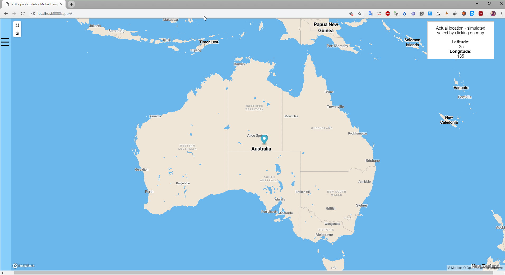

- Zobrazenie 10 najbližších verejných záchodov. Klik na záchod otvorý popup popis
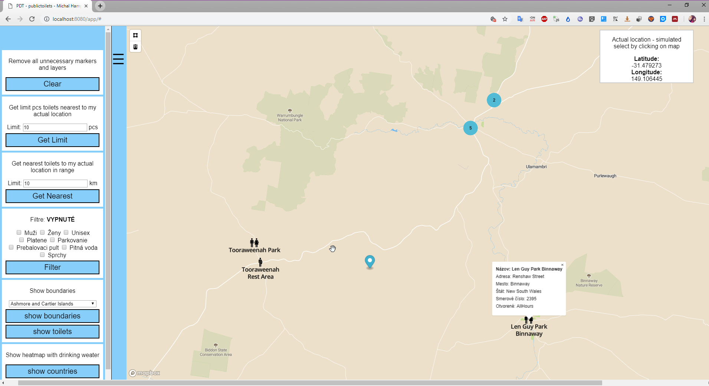

- Zobrazenie najbližsích verejných záchodov v okruhu 300km
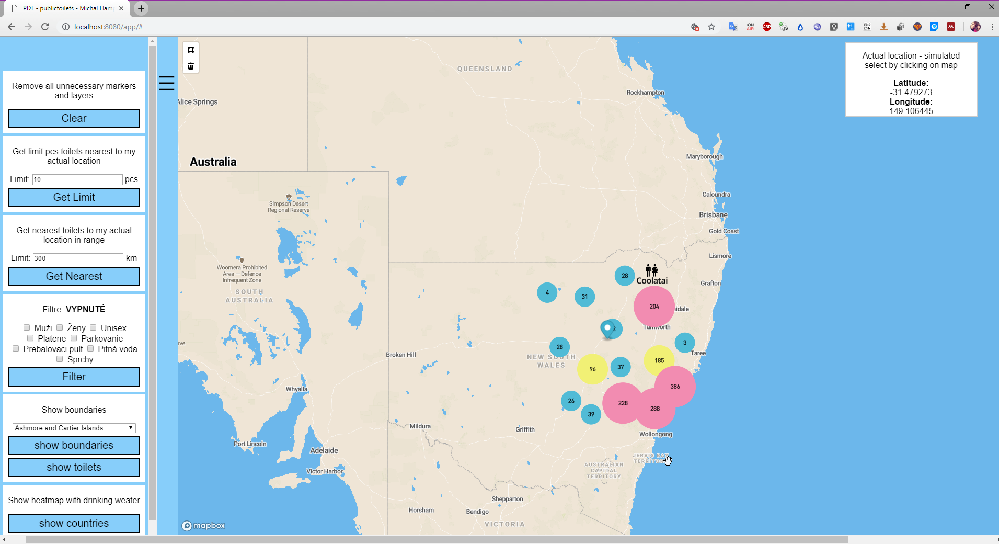

- Zobrazenie najbližsích verejných záchodov v okruhu 300km. Spustený filter pitná voda


- Zobrazenie hraníc oblasti Western Austrália
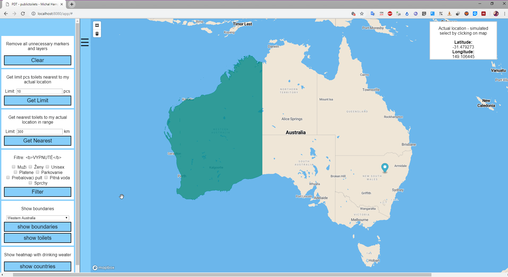

- Zobrazenie verejných záchodov v oblasti Western Austrália
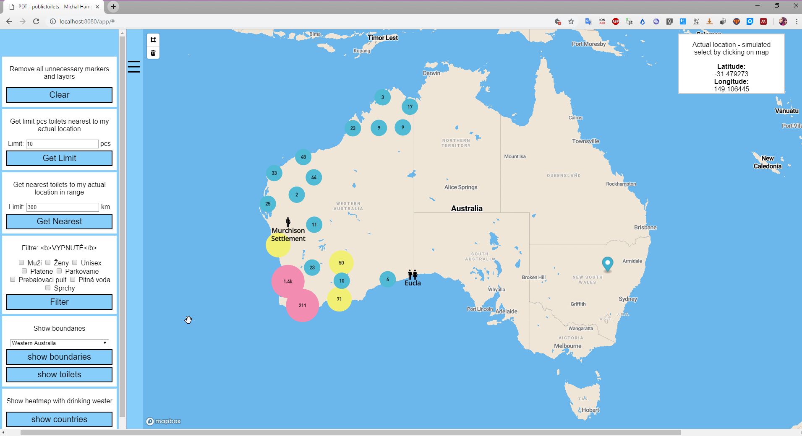

- Zobrazenie heatmapy, ktorá znázoňuje v ktorých oblastiach je najviac a naopak najmenej pitnej vody na verejných záchodoch
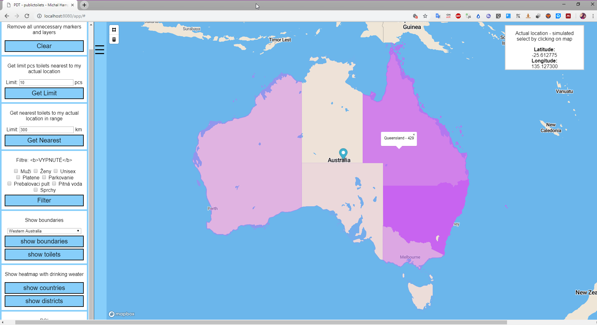

- Zobrazenie heatmapy, ktorá znázoňuje v ktorých mestách (okresoch) je najviac a naopak najmenej pitnej vody na verejných záchodoch
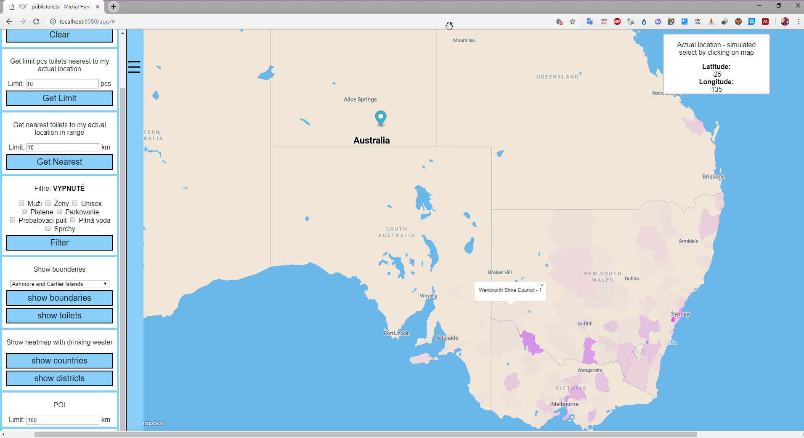

- Zobrazenie POI v oblasti 100km od verejného záchoda na ktorý sa klikne dvojklikom
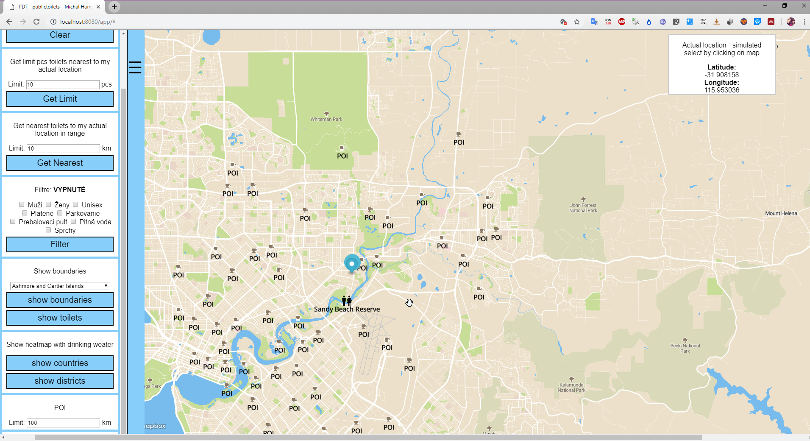

- Nakreslenie polygónu a zobrazenie verejných záchodov v jeho vnútri
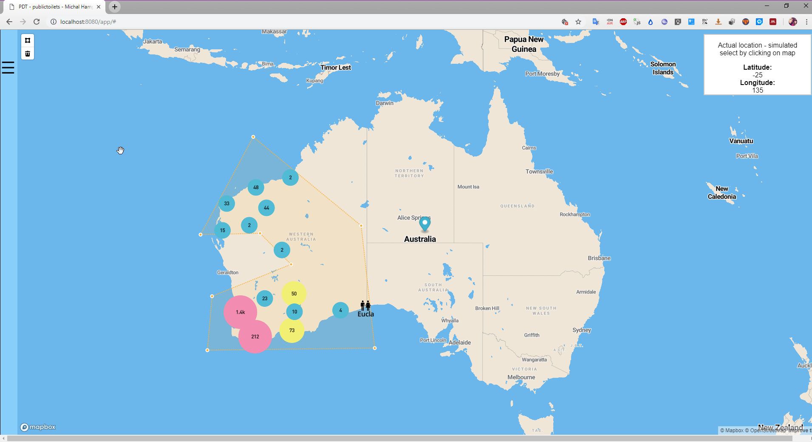


# Frontend
Frontend aplikácia pozostáva zo statickej html stránky. Html stránka je pridaná ako resource aplikačného servera a teda po jeho naštartovaní  je k dispozícii na zobrazenie. Index.html obsahuje skript (script.js), v ktorej je celá logika frontendu a to teda volania na backend a zobrazovanie dopytov na stránku. Na zobrazovanie sa využíva mapbox gl knižnica, ktorá je taktiež referencovaná v hlavnej stránke. Index.html do seba vkladá kaskádové štýly pre lepší dizajn aplikácie (styles.css), ďalej obsahuje menu.js, ktoré sa stará o ovládanie menu.

# Backend

Backend aplikácia je napísaná v Jave. Aplikácia je spustená na webovom server Tomcat a funguje ako REST server, ktorý počúva na dopyty a odpovedá v o forme JSON správ. Pozostáva z dvoch hlavných Java tried `Connector.java` a `Controller.java`. Connector sa stara o pripojenie k databáze a obstarávanie GET requestov. Controller sa stará o zostrojenie query a jeho vykonanie a poskladanie výslednej JSON správy.

## Data

Dáta mám z viacerých zdrojov. Hlavný zdroj z ktorého sa skladá jadro aplikácie sa nachádza na webovej lokalite pre otvorené dáta Austrálie: `https://data.gov.au/dataset/national-public-toilet-map/resource/54566d76-a809-4959-8622-61dc30b3114d`
Hranice oblastí Austrálie: `https://www.igismap.com/australia-shapefile-download/`
Ostatné dáta vo formáte osm: `http://download.geofabrik.de/australia-oceania/australia.html` - tieto dáta bolo potrebné naimportovať do databázy pomocou nástroja osm2pgsql


## Api

**Find hotels in proximity to coordinates**

`GET /search?lat=25346&long=46346123`

**Find hotels by name, sorted by proximity and quality**

`GET /search?name=hviezda&lat=25346&long=46346123`

### Response

API calls return json responses with 2 top-level keys, `hotels` and `geojson`. `hotels` contains an array of hotel data for the sidebar, one entry per matched hotel. Hotel attributes are (mostly self-evident):
```
{
  "name": "Modra hviezda",
  "style": "modern", # cuisine style
  "stars": 3,
  "address": "Panska 31"
  "image_url": "/assets/hotels/652.png"
}
```
`geojson` contains a geojson with locations of all matched hotels and style definitions.


## Optimalisation

- Keďže hlavné dáta ktoré sa využívajú najviac neobsahovali stĺpec geometry, tak prvá optimalizácia bolo vytvorenie tohoto stĺpca na základe longituda a latitude a následnom vytvorení indexu na geometry stĺpci pretože sa používa pri dopytoch ci sa verejný záchod nachádza alebo nenachádza v nejakej oblasti.
```SQL
SELECT AddGeometryColumn('toilet', 'geom', 4326, 'POINT', 2);
UPDATE toilet SET geom = ST_SetSRID(ST_MakePoint(longitude, latitude), 4326);  
CREATE INDEX idx_toilet ON toilet USING gist(geom); 
```

Prvú optimalizáciu som následne využil na dohľadanie verených záchodov v okruhu. (Total cost sa zmenšil na 1/3)
```SQL
SELECT *, ST_AsGeoJSON(geom) as geometry
FROM toilet
WHERE ST_DWithin(geom, ST_MakePoint(135,-25)::geography, 200000); 
```

- Využitie <--> operátora - vráti najbližích susedov na zákalde centra geometrie. Nájdenie najbližších verejných záchodov
```SQL
SELECT *, ST_AsGeoJSON(geom) as geometry  
FROM toilet 
ORDER BY geom 
<-> 
st_setsrid(st_makepoint(135,-25),4326) 
LIMIT 10;
```

- Keďže dáta o hraniciach austrálskych oblastí mám veľmi presné, vznikol tu problem že rozne oblasti sa skladali z MULTIPOLYGONU ktorý obsahoval napríklad aj 6000 menších polygónov. Pri vyhľadávaní záchodov v tejto oblasti sa prehľadávali aj tei ktoré žiadny záchod neobsahovali a tak som vtvoril novú tabuľku bez týchto prázdnych polygónov.
```SQL
--multipolygon to polygons
create table australia_boundaries_polygons as 
SELECT id,(ST_Dump(geom)).geom as geometry 
FROM public.australiaboundaries

--polygony ktore obsahuju z8chody
create table australia_boundaries_contains_geometry as 
SELECT UNNEST("area_list") geom FROM (
SELECT array_agg(ar.geometry) as area_list
FROM australia_boundaries_polygons ar, toilet pl 
WHERE ST_Contains(ST_SETSRID(ar.geometry,4326), pl.geom) 
GROUP BY pl.toiletid
ORDER BY pl.toiletid) s group by geom; 

--sparovanie mena a geometrie
create table australia_boundaries_result as 
select abp.* from australia_boundaries_polygons abp 
join australia_boundaries_contains_geometry abcg on abp.geometry=abcg.geom order by id

```
Zmena z 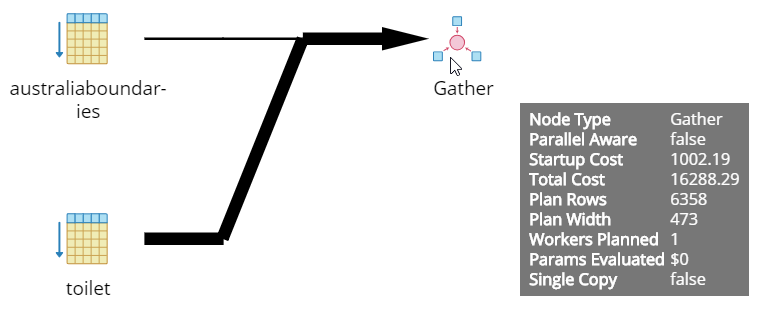 na 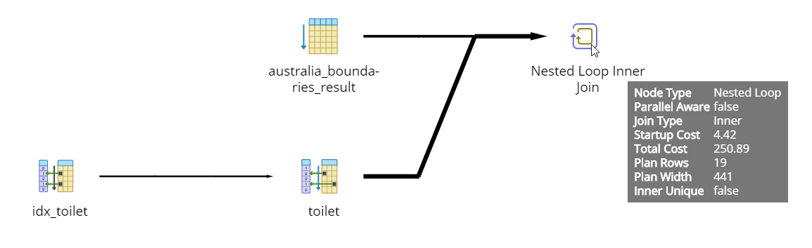


