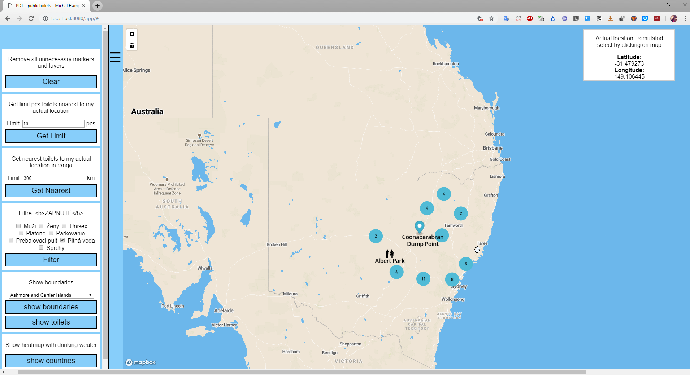

# Overview
Táto aplikácia dokáže zobrazovať verejné záchody po celej Austrálii. Scenáre, ktoré dokáže aplikácia zobraziť používateľovi
-	Keďže sa aplikácia nachádza mimo územia SR, je to zobrazený marker, ktorý simuluje aktuálnu polohu
-	Zobrazenie N najbližších verejných záchodov na základe aktuálnej polohy. (aj filtre)
-	Zobrazenie najbližších záchodov na základe zadanej vzdialenosti od aktuálnej polohy. (aj filtre)
-	Zapnutie filtrov, ak sú filtre zapojené zapoja sa do viacerých scenárov.
-	Zobrazenie území ako polygón = výber z combo boxa
-	Zobrazenie verejných záchodov v určitom polygóne (aj filtre)
-	Nakreslenie polygónu a zobrazenie verejných záchodov v ňom

# Screenshots  

- Úvodná obrazovka


- Zobrazenie 10 najbližších verejných záchodov. Klik na záchod otvorý popup popis


- Zobrazenie najbližsích verejných záchodov v okruhu 300km


- Zobrazenie najbližsích verejných záchodov v okruhu 300km. Spustený filter pitná voda


- Zobrazenie hraníc oblasti Western Austrália


- Zobrazenie verejných záchodov v oblasti Western Austrália


- Zobrazenie heatmapy, ktorá znázoňuje v ktorých oblastiach je najviac a naopak najmenej pitnej vody na verejných záchodoch


- Zobrazenie heatmapy, ktorá znázoňuje v ktorých mestách (okresoch) je najviac a naopak najmenej pitnej vody na verejných záchodoch


- Zobrazenie POI v oblasti 100km od verejného záchoda na ktorý sa klikne dvojklikom


- Nakreslenie polygónu a zobrazenie verejných záchodov v jeho vnútri


# Frontend
Frontend aplikácia pozostáva zo statickej html stránky. Html stránka je pridaná ako resource aplikačného servera a teda po jeho naštartovaní  je k dispozícii na zobrazenie. Index.html obsahuje skript (script.js), v ktorej je celá logika frontendu a to teda volania na backend a zobrazovanie dopytov na stránku. Na zobrazovanie sa využíva mapbox gl knižnica, ktorá je taktiež referencovaná v hlavnej stránke. Index.html do seba vkladá kaskádové štýly pre lepší dizajn aplikácie (styles.css), ďalej obsahuje menu.js, ktoré sa stará o ovládanie menu.

# Backend

Backend aplikácia je napísaná v Jave. Aplikácia je spustená na webovom server Tomcat a funguje ako REST server, ktorý počúva na dopyty a odpovedá v o forme JSON správ. Pozostáva z dvoch hlavných Java tried `Connector.java` a `Controller.java`. Connector sa stara o pripojenie k databáze a obstarávanie GET requestov. Controller sa stará o zostrojenie query a jeho vykonanie a poskladanie výslednej JSON správy.

## Data

Dáta mám z viacerých zdrojov. Hlavný zdroj z ktorého sa skladá jadro aplikácie sa nachádza na webovej lokalite pre otvorené dáta Austrálie: `https://data.gov.au/dataset/national-public-toilet-map/resource/54566d76-a809-4959-8622-61dc30b3114d`
Hranice oblastí Austrálie: `https://www.igismap.com/australia-shapefile-download/`
Ostatné dáta vo formáte osm: `http://download.geofabrik.de/australia-oceania/australia.html` - tieto dáta bolo potrebné naimportovať do databázy pomocou nástroja osm2pgsql

## Použité postgist funkcie
1. ST_AsGeoJSON
2. ST_Point
3. ST_Union
4. ST_Dump
5. ST_Contains
6. ST_Transform
7. ST_SetSRID
8. ST_GeomFromGeoJSON
9. ST_DWithin
10. ST_MakePoint
11. ST_Distance_Sphere

## Api

**Nájdenie N najbližších verejnych záchodov**

`GET /nearestcount?longitude135&latitude-25&limit10`

**Response**

```JSON
{
  "features": [
    {
      "geometry": {
        "coordinates": [
          135.2484994,
          -26.07050006
        ],
        "type": "Point"
      },
      "type": "Feature",
      "properties": {
        "font-color": "#000000",
        "isopen": "Variable",
        "marker-symbol": "toilets",
        "address": "Mount Dare Road",
        "town": "Finke",
        "icon": "unisex",
        "name": "Witjira National Park 1",
        "postcode": "0872",
        "state": "Northern Territory"
      }
    },
    ...
  ]
}
```

**Nájdenie najbližšie verejne záchody v okruhu N km**

`GET /nearest?longitude=150.82031250000546&latitude=-33.62742849477819&distance=10000`

**Response**

```JSON
{
  "features": [
    {
      "geometry": {
        "coordinates": [
          150.80352581,
          -33.55922095
        ],
        "type": "Point"
      },
      "type": "Feature",
      "properties": {
        "font-color": "#007fff",
        "isopen": "AllHours",
        "marker-symbol": "toilets",
        "address": "356 Kurmond Road",
        "town": "Freemans Reach",
        "icon": "toilet",
        "name": "Freemans Reach Park",
        "postcode": "2756",
        "state": "New South Wales"
      }
    },
    ...
  ]
}
```

**Zobrazenie hraníc oblasti**

`GET /boundary?id=2316598`

**Response**

```JSON
{
  "features": [
    {
      "name": "Western Australia",
      "geometry": {
        "coordinates": [
          [
            [
              117.8714232,
              -35.1918585
            ],
            [
              117.8695438,
              -35.191744
            ],
            ...
          ]
        ],
        "type": "Polygon"
      },
      "id": "2316598",
      "type": "Feature"
    },
    ...
  ]
}
```

**Zobrazenie verejnych záchodov v oblasti**

`GET /boundarypoints?id=2316598`

**Response**

```JSON
{
  "features": [
    {
      "geometry": {
        "coordinates": [
          115.52884845,
          -32.02241248
        ],
        "type": "Point"
      },
      "type": "Feature",
      "properties": {
        "font-color": "#007fff",
        "isopen": "AllHours",
        "marker-symbol": "toilets",
        "address": "Parker Point Road",
        "town": "Rottnest Island",
        "icon": "toilet",
        "name": "Parker Point",
        "postcode": "6161",
        "state": "Western Australia"
      }
    },
    ...
  ]
}
```


**Zobrazenie heatmapy oblasti**

`GET /heatmapcountries`

**Response**

```JSON
[
  {
    "name": "New South Wales",
    "count": 554
  },
  {
    "name": "Queensland",
    "count": 429
  },
  ...
]
```


**Zobrazenie heatmapy okresu**

`GET /heatmapdistricts`

**Response**

```JSON
[
  {
    "name": "Sutherland Shire Council",
    "count": 83
  },
  {
    "name": "Northern Beaches Council",
    "count": 66
  },
  {
  ...
]
```


**Nakreslenie polygónu a zobrazenie verejných záchodov vo vnútri**

`GET /polygon?geojson={"type":"FeatureCollection","features":[{"id":"ce13360faeebb97b4c82886e84e7cced","type":"Feature","properties":{},"geometry":{"coordinates":[[[148.7109374999971,-20.85265332853281],[152.5341796874908,-19.367123496979104],[156.7089843749859,-29.663236089948896],[143.6132812500055,-25.85329304169605],[148.7109374999971,-20.85265332853281]]],"type":"Polygon"}}]}`

**Response**

```JSON
{
  "features": [
    {
      "geometry": {
        "coordinates": [
          148.04524183,
          -22.01444418
        ],
        "type": "Point"
      },
      "type": "Feature",
      "properties": {
        "font-color": "#007fff",
        "isopen": "AllHours",
        "marker-symbol": "toilets",
        "address": "Moranbah Access Road",
        "town": "Moranbah",
        "icon": "toilet",
        "name": "Apex Park",
        "postcode": "4744",
        "state": "Queensland"
      }
    },
  ...
  ],
}
```


## Optimalisation

- Keďže hlavné dáta ktoré sa využívajú najviac neobsahovali stĺpec geometry, tak prvá optimalizácia bolo vytvorenie tohoto stĺpca na základe longituda a latitude a následnom vytvorení indexu na geometry stĺpci pretože sa používa pri dopytoch ci sa verejný záchod nachádza alebo nenachádza v nejakej oblasti.
```SQL
SELECT AddGeometryColumn('toilet', 'geom', 4326, 'POINT', 2);
UPDATE toilet SET geom = ST_SetSRID(ST_MakePoint(longitude, latitude), 4326);  
CREATE INDEX idx_toilet ON toilet USING gist(geom); 
```

Prvú optimalizáciu som následne využil na dohľadanie verených záchodov v okruhu. (Total cost sa zmenšil na 1/3)
```SQL
SELECT *, ST_AsGeoJSON(geom) as geometry
FROM toilet
WHERE ST_DWithin(geom, ST_MakePoint(135,-25)::geography, 200000); 
```

- Využitie <--> operátora - vráti najbližích susedov na zákalde centra geometrie. Nájdenie najbližších verejných záchodov
```SQL
SELECT *, ST_AsGeoJSON(geom) as geometry  
FROM toilet 
ORDER BY geom 
<-> 
st_setsrid(st_makepoint(135,-25),4326) 
LIMIT 10;
```

- Keďže dáta o hraniciach austrálskych oblastí mám veľmi presné, vznikol tu problem že rozne oblasti sa skladali z MULTIPOLYGONU ktorý obsahoval napríklad aj 6000 menších polygónov. Pri vyhľadávaní záchodov v tejto oblasti sa prehľadávali aj tei ktoré žiadny záchod neobsahovali a tak som vtvoril novú tabuľku bez týchto prázdnych polygónov.
```SQL
--multipolygon to polygons
create table australia_boundaries_polygons as 
SELECT id,(ST_Dump(geom)).geom as geometry 
FROM public.australiaboundaries

--polygony ktore obsahuju z8chody
create table australia_boundaries_contains_geometry as 
SELECT UNNEST("area_list") geom FROM (
SELECT array_agg(ar.geometry) as area_list
FROM australia_boundaries_polygons ar, toilet pl 
WHERE ST_Contains(ST_SETSRID(ar.geometry,4326), pl.geom) 
GROUP BY pl.toiletid
ORDER BY pl.toiletid) s group by geom; 

--sparovanie mena a geometrie
create table australia_boundaries_result as 
select abp.* from australia_boundaries_polygons abp 
join australia_boundaries_contains_geometry abcg on abp.geometry=abcg.geom order by id

```
Zmena z
 
na 


- Optimalizácie pre zobrazenie POI
```SQL
create table poi AS (select ST_AsGeoJSON(ST_Transform(way, 4326)) AS geojson, amenity, way 
FROM planet_osm_point 
where (amenity LIKE 'fuel' OR amenity LIKE 'bar' OR amenity LIKE 'cafe' OR amenity LIKE 'restaurant' )
order by amenity)

CREATE INDEX idx_poi ON poi(amenity);
```

## Query explain

** Query getNearestCount 100 pred optimalizáciou **
```SQL
EXPLAIN (FORMAT JSON) SELECT * FROM 
(SELECT ST_Distance_Sphere(ST_Point(116,-32), ST_Point(longitude,latitude)) AS distance
, ST_AsGeoJSON(ST_Point(longitude,latitude),4326) AS result , name, * 
FROM toilet  ORDER BY distance ) as res LIMIT 100

```
** Explain **
```JSON
[
  {
    "Plan": {
      "Node Type": "Limit",
      "Parallel Aware": false,
      "Startup Cost": 15073.12,
      "Total Cost": 15336.37,
      "Plan Rows": 100,
      "Plan Width": 502,
      "Plans": [
        {
          "Node Type": "Gather Merge",
          "Parent Relationship": "Outer",
          "Parallel Aware": false,
          "Startup Cost": 15073.12,
          "Total Cost": 44497.57,
          "Plan Rows": 11220,
          "Plan Width": 502,
          "Workers Planned": 1,
          "Plans": [
            {
              "Node Type": "Result",
              "Parent Relationship": "Outer",
              "Parallel Aware": false,
              "Startup Cost": 14073.11,
              "Total Cost": 50846.66,
              "Plan Rows": 11220,
              "Plan Width": 502,
              "Plans": [
                {
                  "Node Type": "Sort",
                  "Parent Relationship": "Outer",
                  "Parallel Aware": false,
                  "Startup Cost": 14073.11,
                  "Total Cost": 14101.16,
                  "Plan Rows": 11220,
                  "Plan Width": 470,
                  "Sort Key": [
                    "(st_distance_sphere('01010000000000000000005D4000000000000040C0'::geometry, st_point((toilet.longitude)::double precision, (toilet.latitude)::double precision)))"
                  ],
                  "Plans": [
                    {
                      "Node Type": "Seq Scan",
                      "Parent Relationship": "Outer",
                      "Parallel Aware": true,
                      "Relation Name": "toilet",
                      "Alias": "toilet",
                      "Startup Cost": 0,
                      "Total Cost": 10938.35,
                      "Plan Rows": 11220,
                      "Plan Width": 470
                    }
                  ]
                }
              ]
            }
          ]
        }
      ]
    }
  }
]
```

** Query getNearestCount 100 po optimalizácii **
```SQL
EXPLAIN (FORMAT JSON)
SELECT *, ST_AsGeoJSON(geom) as geometry  
FROM toilet ORDER BY geom <-> st_setsrid(st_makepoint(116,-32),4326) LIMIT 100
```
** Explain **
```JSON
[
  {
    "Plan": {
      "Node Type": "Limit",
      "Parallel Aware": false,
      "Startup Cost": 0.28,
      "Total Cost": 304.07,
      "Plan Rows": 100,
      "Plan Width": 481,
      "Plans": [
        {
          "Node Type": "Index Scan",
          "Parent Relationship": "Outer",
          "Parallel Aware": false,
          "Scan Direction": "NoMovement",
          "Index Name": "idx_toilet",
          "Relation Name": "toilet",
          "Alias": "toilet",
          "Startup Cost": 0.28,
          "Total Cost": 57946.75,
          "Plan Rows": 19074,
          "Plan Width": 481,
          "Order By": "(geom <-> '0101000020E61000000000000000005D4000000000000040C0'::geometry)"
        }
      ]
    }
  }
]
```


** Query getNearest by Distance 100 km pred optimalizáciou **
```SQL
EXPLAIN (FORMAT JSON)
SELECT * FROM (SELECT ST_Distance_Sphere(ST_Point(116,-32)
, ST_Point(longitude,latitude)) AS distance, ST_AsGeoJSON(ST_Point(longitude,latitude),4326) AS result, name, * 
FROM toilet  ORDER BY distance ) as res 
WHERE distance < 100000
```
** Explain **
```JSON
[
  {
    "Plan": {
      "Node Type": "Gather Merge",
      "Parallel Aware": false,
      "Startup Cost": 24399.46,
      "Total Cost": 24829.56,
      "Plan Rows": 3740,
      "Plan Width": 502,
      "Workers Planned": 1,
      "Plans": [
        {
          "Node Type": "Sort",
          "Parent Relationship": "Outer",
          "Parallel Aware": false,
          "Startup Cost": 23399.45,
          "Total Cost": 23408.8,
          "Plan Rows": 3740,
          "Plan Width": 502,
          "Sort Key": [
            "(st_distance_sphere('01010000000000000000005D4000000000000040C0'::geometry, st_point((toilet.longitude)::double precision, (toilet.latitude)::double precision)))"
          ],
          "Plans": [
            {
              "Node Type": "Seq Scan",
              "Parent Relationship": "Outer",
              "Parallel Aware": true,
              "Relation Name": "toilet",
              "Alias": "toilet",
              "Startup Cost": 0,
              "Total Cost": 23177.5,
              "Plan Rows": 3740,
              "Plan Width": 502,
              "Filter": "(st_distance_sphere('01010000000000000000005D4000000000000040C0'::geometry, st_point((longitude)::double precision, (latitude)::double precision)) < '100000'::double precision)"
            }
          ]
        }
      ]
    }
  }
]
```

** Query getNearest by Distance 100 km po optimalizácii **
```SQL
EXPLAIN (FORMAT JSON)
SELECT *, ST_AsGeoJSON(geom) as geometry  
FROM toilet WHERE ST_DWithin(geom, ST_MakePoint(116,-32)::geography, 100000)
```
** Explain **
```JSON
[
  {
    "Plan": {
      "Node Type": "Gather",
      "Parallel Aware": false,
      "Startup Cost": 1000,
      "Total Cost": 8184.85,
      "Plan Rows": 254,
      "Plan Width": 473,
      "Workers Planned": 1,
      "Single Copy": false,
      "Plans": [
        {
          "Node Type": "Seq Scan",
          "Parent Relationship": "Outer",
          "Parallel Aware": true,
          "Relation Name": "toilet",
          "Alias": "toilet",
          "Startup Cost": 0,
          "Total Cost": 7159.45,
          "Plan Rows": 149,
          "Plan Width": 473,
          "Filter": "(((geom)::geography && '0101000020E61000000000000000005D4000000000000040C0'::geography) AND ('0101000020E61000000000000000005D4000000000000040C0'::geography && _st_expand((geom)::geography, '100000'::double precision)) AND _st_dwithin((geom)::geography, '0101000020E61000000000000000005D4000000000000040C0'::geography, '100000'::double precision, true))"
        }
      ]
    }
  }
]
```


**Query getPointsInsideBoundaries pred optimalizáciou**
```SQL
EXPLAIN (FORMAT JSON)
SELECT  *, ST_AsGeoJSON(geom) as geometry  FROM toilet 
WHERe st_contains(ST_Transform(ST_SetSRID((select geom from australiaboundaries where id =2316598),4326),4326),  geom)=true
```
**Explain **
```JSON
[
  {
    "Plan": {
      "Node Type": "Gather",
      "Parallel Aware": false,
      "Startup Cost": 1002.19,
      "Total Cost": 16288.29,
      "Plan Rows": 6358,
      "Plan Width": 473,
      "Workers Planned": 1,
      "Params Evaluated": [
        "$0"
      ],
      "Single Copy": false,
      "Plans": [
        {
          "Node Type": "Seq Scan",
          "Parent Relationship": "InitPlan",
          "Subplan Name": "InitPlan 1 (returns $0)",
          "Parallel Aware": false,
          "Relation Name": "australiaboundaries",
          "Alias": "australiaboundaries",
          "Startup Cost": 0,
          "Total Cost": 2.19,
          "Plan Rows": 1,
          "Plan Width": 1018528,
          "Filter": "(id = 2316598)"
        },
        {
          "Node Type": "Seq Scan",
          "Parent Relationship": "Outer",
          "Parallel Aware": true,
          "Relation Name": "toilet",
          "Alias": "toilet",
          "Startup Cost": 0,
          "Total Cost": 14650.3,
          "Plan Rows": 3740,
          "Plan Width": 473,
          "Filter": "st_contains(st_transform(st_setsrid($0, 4326), 4326), geom)"
        }
      ]
    }
  }
]
```

**Query getPointsInsideBoundaries po optimalizácii **
```SQL

EXPLAIN (FORMAT JSON)
SELECT t.*,ST_AsGeoJSON(t.geom) as geometry  
FROM  toilet AS t,  australia_boundaries_result AS r 
WHERE r.id=2316598 and ST_CONTAINS(r.geom, t.geom) 

```
**Explain **
```JSON
[
  {
    "Plan": {
      "Node Type": "Nested Loop",
      "Parallel Aware": false,
      "Join Type": "Inner",
      "Startup Cost": 4.42,
      "Total Cost": 298.1,
      "Plan Rows": 19,
      "Plan Width": 473,
      "Inner Unique": false,
      "Plans": [
        {
          "Node Type": "Seq Scan",
          "Parent Relationship": "Outer",
          "Parallel Aware": false,
          "Relation Name": "australia_boundaries_result",
          "Alias": "r",
          "Startup Cost": 0,
          "Total Cost": 9.65,
          "Plan Rows": 3,
          "Plan Width": 199300,
          "Filter": "(id = 2316598)"
        },
        {
          "Node Type": "Bitmap Heap Scan",
          "Parent Relationship": "Inner",
          "Parallel Aware": false,
          "Relation Name": "toilet",
          "Alias": "t",
          "Startup Cost": 4.42,
          "Total Cost": 80.26,
          "Plan Rows": 6,
          "Plan Width": 441,
          "Recheck Cond": "(r.geom ~ geom)",
          "Filter": "_st_contains(r.geom, geom)",
          "Plans": [
            {
              "Node Type": "Bitmap Index Scan",
              "Parent Relationship": "Outer",
              "Parallel Aware": false,
              "Index Name": "idx_toilet",
              "Startup Cost": 0,
              "Total Cost": 4.42,
              "Plan Rows": 19,
              "Plan Width": 0,
              "Index Cond": "(r.geom ~ geom)"
            }
          ]
        }
      ]
    }
  }
]
```


**Query heatmap data countries  po optimalizácii uz som mal pripravené data **
```SQL
EXPLAIN (FORMAT JSON)
SELECT a.name, count(a.name) as count  
FROM  toilet AS t,  australia_countries AS a 
WHERE t.drinkingwater like 'True' and ST_CONTAINS(a.geom, t.geom) group by a.name order by count desc
```
**Explain **
```JSON
[
  {
    "Plan": {
      "Node Type": "Sort",
      "Parallel Aware": false,
      "Startup Cost": 7032.22,
      "Total Cost": 7032.25,
      "Plan Rows": 12,
      "Plan Width": 21,
      "Sort Key": [
        "(count(a.name)) DESC"
      ],
      "Plans": [
        {
          "Node Type": "Aggregate",
          "Strategy": "Sorted",
          "Partial Mode": "Simple",
          "Parent Relationship": "Outer",
          "Parallel Aware": false,
          "Startup Cost": 7031.41,
          "Total Cost": 7032.01,
          "Plan Rows": 12,
          "Plan Width": 21,
          "Group Key": [
            "a.name"
          ],
          "Plans": [
            {
              "Node Type": "Sort",
              "Parent Relationship": "Outer",
              "Parallel Aware": false,
              "Startup Cost": 7031.41,
              "Total Cost": 7031.57,
              "Plan Rows": 64,
              "Plan Width": 13,
              "Sort Key": [
                "a.name"
              ],
              "Plans": [
                {
                  "Node Type": "Nested Loop",
                  "Parent Relationship": "Outer",
                  "Parallel Aware": false,
                  "Join Type": "Inner",
                  "Startup Cost": 3.26,
                  "Total Cost": 7029.49,
                  "Plan Rows": 64,
                  "Plan Width": 13,
                  "Inner Unique": false,
                  "Plans": [
                    {
                      "Node Type": "Seq Scan",
                      "Parent Relationship": "Outer",
                      "Parallel Aware": false,
                      "Relation Name": "australia_countries",
                      "Alias": "a",
                      "Startup Cost": 0,
                      "Total Cost": 85.21,
                      "Plan Rows": 121,
                      "Plan Width": 20079
                    },
                    {
                      "Node Type": "Bitmap Heap Scan",
                      "Parent Relationship": "Inner",
                      "Parallel Aware": false,
                      "Relation Name": "toilet",
                      "Alias": "t",
                      "Startup Cost": 3.26,
                      "Total Cost": 57.38,
                      "Plan Rows": 1,
                      "Plan Width": 32,
                      "Recheck Cond": "(a.geom ~ geom)",
                      "Filter": "((drinkingwater ~~ 'True'::text) AND _st_contains(a.geom, geom))",
                      "Plans": [
                        {
                          "Node Type": "Bitmap Index Scan",
                          "Parent Relationship": "Outer",
                          "Parallel Aware": false,
                          "Index Name": "idx_toilet",
                          "Startup Cost": 0,
                          "Total Cost": 3.26,
                          "Plan Rows": 19,
                          "Plan Width": 0,
                          "Index Cond": "(a.geom ~ geom)"
                        }
                      ]
                    }
                  ]
                }
              ]
            }
          ]
        }
      ]
    }
  }
]
```


**Query heatmap data districts  po optimalizácii uz som mal pripravené data **
```SQL
EXPLAIN (FORMAT JSON)
SELECT a.name, count(a.name) as count  
FROM  toilet AS t,  australia_districts AS a 
WHERE t.drinkingwater like 'True' and ST_CONTAINS(a.geom, t.geom) group by a.name order by count desc
```
**Explain **
```JSON
[
  {
    "Plan": {
      "Node Type": "Sort",
      "Parallel Aware": false,
      "Startup Cost": 11424.93,
      "Total Cost": 11425.29,
      "Plan Rows": 146,
      "Plan Width": 27,
      "Sort Key": [
        "(count(a.name)) DESC"
      ],
      "Plans": [
        {
          "Node Type": "Aggregate",
          "Strategy": "Sorted",
          "Partial Mode": "Simple",
          "Parent Relationship": "Outer",
          "Parallel Aware": false,
          "Startup Cost": 11417.12,
          "Total Cost": 11419.68,
          "Plan Rows": 146,
          "Plan Width": 27,
          "Group Key": [
            "a.name"
          ],
          "Plans": [
            {
              "Node Type": "Sort",
              "Parent Relationship": "Outer",
              "Parallel Aware": false,
              "Startup Cost": 11417.12,
              "Total Cost": 11417.49,
              "Plan Rows": 146,
              "Plan Width": 19,
              "Sort Key": [
                "a.name"
              ],
              "Plans": [
                {
                  "Node Type": "Nested Loop",
                  "Parent Relationship": "Outer",
                  "Parallel Aware": false,
                  "Join Type": "Inner",
                  "Startup Cost": 0.28,
                  "Total Cost": 11411.87,
                  "Plan Rows": 146,
                  "Plan Width": 19,
                  "Inner Unique": false,
                  "Plans": [
                    {
                      "Node Type": "Seq Scan",
                      "Parent Relationship": "Outer",
                      "Parallel Aware": false,
                      "Relation Name": "australia_districts",
                      "Alias": "a",
                      "Startup Cost": 0,
                      "Total Cost": 50.75,
                      "Plan Rows": 275,
                      "Plan Width": 47279
                    },
                    {
                      "Node Type": "Index Scan",
                      "Parent Relationship": "Inner",
                      "Parallel Aware": false,
                      "Scan Direction": "NoMovement",
                      "Index Name": "idx_toilet",
                      "Relation Name": "toilet",
                      "Alias": "t",
                      "Startup Cost": 0.28,
                      "Total Cost": 41.3,
                      "Plan Rows": 1,
                      "Plan Width": 32,
                      "Index Cond": "(a.geom ~ geom)",
                      "Filter": "((drinkingwater ~~ 'True'::text) AND _st_contains(a.geom, geom))"
                    }
                  ]
                }
              ]
            }
          ]
        }
      ]
    }
  }
]
```


**Query getPointsFromDrawedPolygon - ziskanie zachodov z nakresleneho polygonu preneseneho na server pomocou GeoJSON  **
```SQL
EXPLAIN (FORMAT JSON)
SELECT  *, ST_AsGeoJSON(geom) as geometry  
FROM toilet 
WHERe st_contains(
	ST_Transform(
		ST_SetSRID(
			(
				(SELECT ST_GeomFromGeoJSON(feat->>'geometry') as geom 
				FROM (  SELECT json_array_elements('{"type":"FeatureCollection","features":[{"id":"ce13360faeebb97b4c82886e84e7cced","type":"Feature","properties":{},"geometry":{"coordinates":[[[148.7109374999971,-20.85265332853281],[152.5341796874908,-19.367123496979104],[156.7089843749859,-29.663236089948896],[143.6132812500055,-25.85329304169605],[148.7109374999971,-20.85265332853281]]],"type":"Polygon"}}]}'::json->'features') AS feat) AS f)
			),4326
		),4326
	),  geom
)=true
```
**Explain **
```JSON
[
  {
    "Plan": {
      "Node Type": "Gather",
      "Parallel Aware": false,
      "Startup Cost": 1002.02,
      "Total Cost": 16288.12,
      "Plan Rows": 6358,
      "Plan Width": 473,
      "Workers Planned": 1,
      "Params Evaluated": [
        "$0"
      ],
      "Single Copy": false,
      "Plans": [
        {
          "Node Type": "Subquery Scan",
          "Parent Relationship": "InitPlan",
          "Subplan Name": "InitPlan 1 (returns $0)",
          "Parallel Aware": false,
          "Alias": "f",
          "Startup Cost": 0,
          "Total Cost": 2.02,
          "Plan Rows": 100,
          "Plan Width": 32,
          "Plans": [
            {
              "Node Type": "ProjectSet",
              "Parent Relationship": "Subquery",
              "Parallel Aware": false,
              "Startup Cost": 0,
              "Total Cost": 0.52,
              "Plan Rows": 100,
              "Plan Width": 32,
              "Plans": [
                {
                  "Node Type": "Result",
                  "Parent Relationship": "Outer",
                  "Parallel Aware": false,
                  "Startup Cost": 0,
                  "Total Cost": 0.01,
                  "Plan Rows": 1,
                  "Plan Width": 0
                }
              ]
            }
          ]
        },
        {
          "Node Type": "Seq Scan",
          "Parent Relationship": "Outer",
          "Parallel Aware": true,
          "Relation Name": "toilet",
          "Alias": "toilet",
          "Startup Cost": 0,
          "Total Cost": 14650.3,
          "Plan Rows": 3740,
          "Plan Width": 473,
          "Filter": "st_contains(st_transform(st_setsrid($0, 4326), 4326), geom)"
        }
      ]
    }
  }
]
```


**Query getPOIinDistance 100km po optimalizácii **
```SQL
EXPLAIN (FORMAT JSON)
SELECT * 
FROM poi 
WHERE ST_DWithin(ST_Transform(way, 4326), ST_MakePoint(116,-32)::geography, 100000 )
```
**Explain **
```JSON
[
  {
    "Plan": {
      "Node Type": "Seq Scan",
      "Parallel Aware": false,
      "Relation Name": "poi",
      "Alias": "poi",
      "Startup Cost": 0,
      "Total Cost": 7598.2,
      "Plan Rows": 241,
      "Plan Width": 101,
      "Filter": "(((st_transform(way, 4326))::geography && '0101000020E61000000000000000005D4000000000000040C0'::geography) AND ('0101000020E61000000000000000005D4000000000000040C0'::geography && _st_expand((st_transform(way, 4326))::geography, '100000'::double precision)) AND _st_dwithin((st_transform(way, 4326))::geography, '0101000020E61000000000000000005D4000000000000040C0'::geography, '100000'::double precision, true))"
    }
  }
]
```
